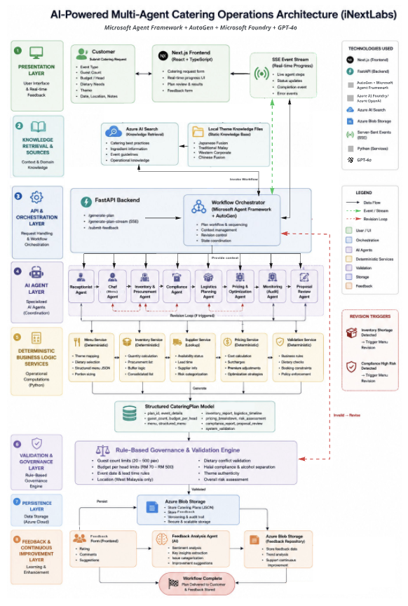
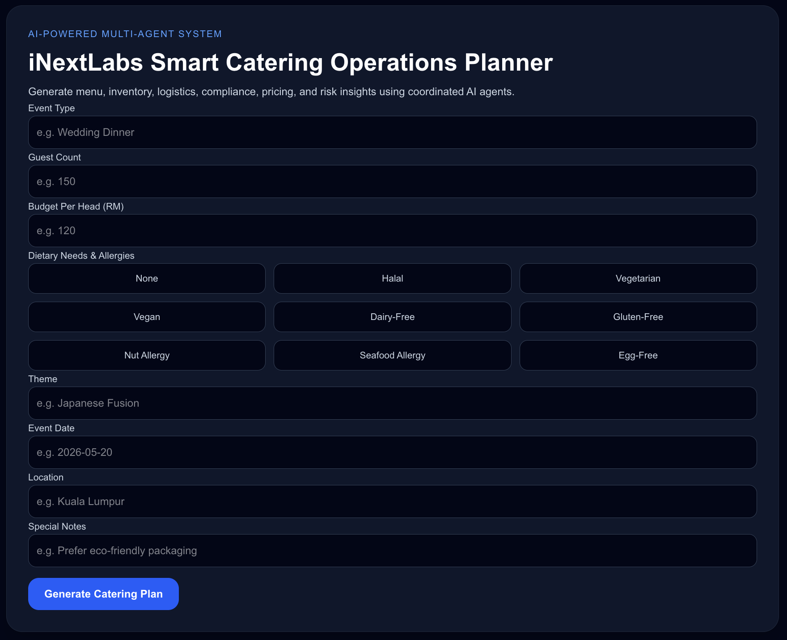
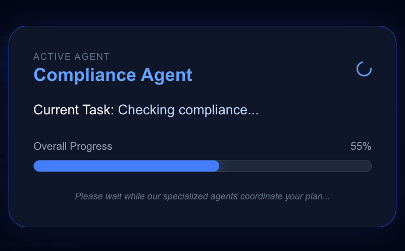
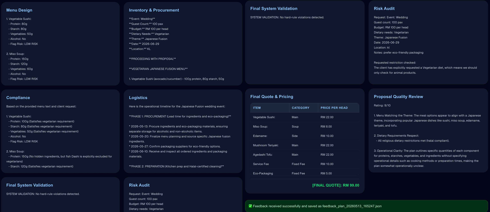
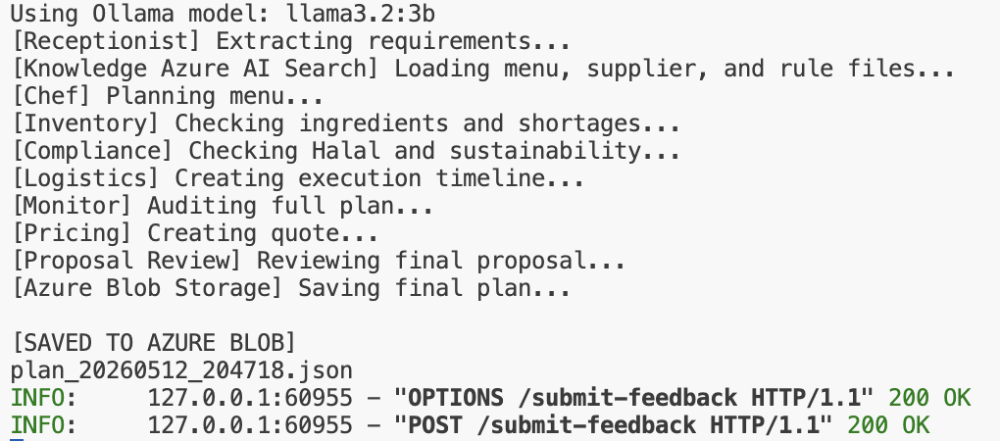
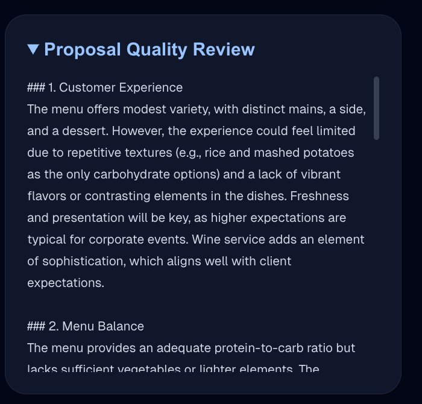
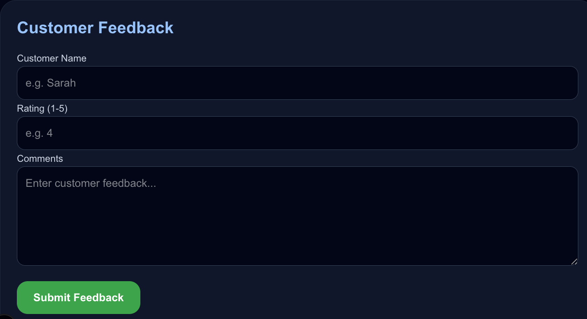
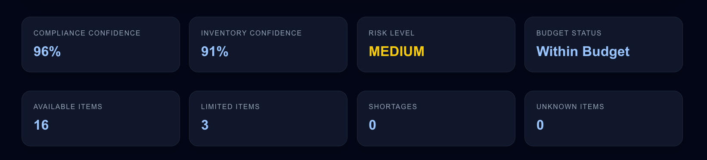
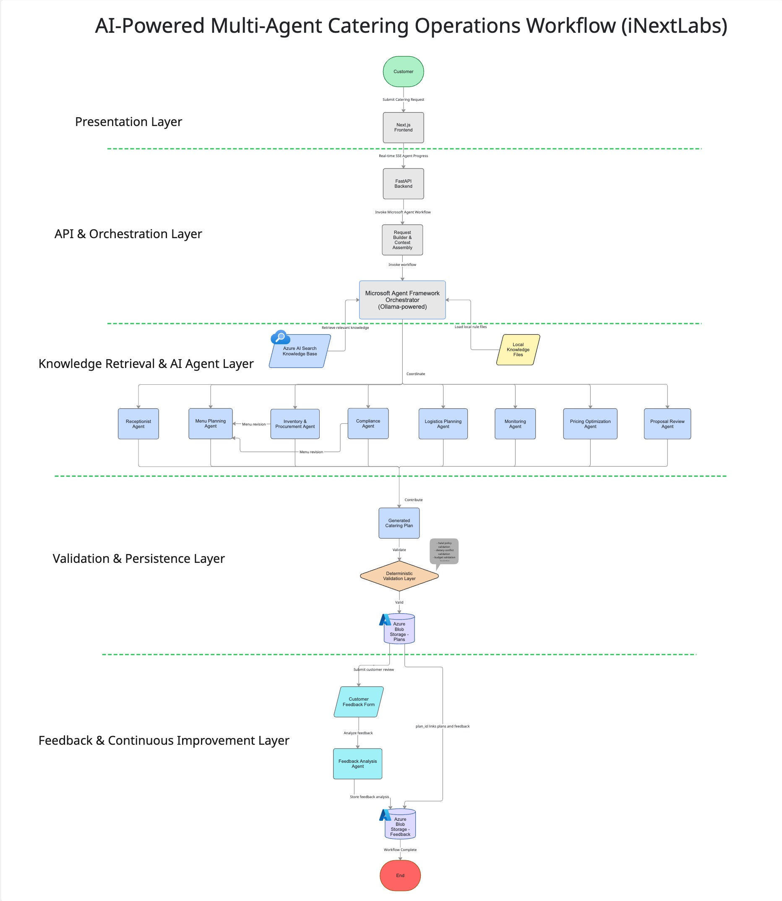

# iNextLabs Smart Catering Operations Planner
### Microsoft Agent Framework + AutoGen + Azure Foundry

A hybrid AI and deterministic multi-agent system for intelligent catering workflow automation. The system helps catering teams generate structured catering plans by coordinating specialized AI agents for customer intake, menu planning, inventory, compliance, logistics, pricing, risk validation, proposal review, and customer feedback analysis.


## Table of Contents

- Problem Statement
- Solution Overview
- Tech Stack
- Features
- AI Agents
- Workflow Orchestration
- Hybrid Architecture
- Business Validation
- Knowledge Base Integration
- Enterprise Workflow Design
- System Architecture
- Installation
- Deployment
- Environment Variables
- Test Cases
- Future Improvements


## Problem Statement Summary

Catering businesses often manage customer requirements, menu planning, inventory, procurement, logistics, pricing, and risk checks manually. This can lead to poor demand estimation, supplier issues, inconsistent pricing, and communication gaps.

This project solves the problem by using a multi-agent AI workflow that simulates a digital catering operations team.


## Solution Overview

The system allows a customer to submit catering requirements through a Next.js frontend interface. Requests are processed by a FastAPI backend where a Microsoft Agent Framework workflow orchestrates specialized AutoGen Assistant Agents powered by Microsoft Foundry-hosted GPT-4o inference.

The system combines:
- Microsoft Agent Framework workflow orchestration
- AutoGen Assistant Agents for specialized AI behaviors
- Microsoft Foundry GPT-4o cloud-hosted inference
- Deterministic Python-based pricing and validation
- Azure AI Search knowledge retrieval
- Azure Blob Storage persistence
- Real-time Server-Sent Event (SSE) workflow updates
- Hybrid local/cloud AI development workflow

Unlike purely generative AI systems, this platform separates:
- AI responsibilities (recommendation, proposal generation, optimization)
- deterministic backend logic (pricing, validation, dietary checks, operational constraints)

This hybrid architecture improves reliability, prevents hallucinated pricing, and enforces business rules consistently.


## Tech Stack

- Next.js
- TypeScript
- Tailwind CSS
- FastAPI
- Python
- Microsoft Foundry
- GPT-4o
- Microsoft Agent Framework
- Azure AI Search
- Azure Blob Storage
- Server-Sent Events (SSE)
- GitHub


## Features

- Multi-agent catering workflow orchestration
- AI-powered menu planning
- Real-time AI workflow observability through SSE streaming
- Deterministic validation engine
- Dietary and halal compliance checks
- Logistics and procurement planning
- Inventory and compliance-driven proposal revision loops
- Azure AI Search knowledge retrieval
- Azure Blob Storage persistence
- Customer feedback analysis


## AI Agents

### 1. Receptionist Agent
Captures customer event requirements and extracts structured operational details.

### 2. Menu Planning Agent
Generates theme-aware catering menus while respecting dietary restrictions and halal requirements.

### 3. Inventory & Procurement Agent
Calculates procurement quantities, checks supplier availability, and estimates ingredient requirements.

### 4. Compliance Agent
Validates halal compliance, dietary compatibility, and operational catering rules.

### 5. Logistics Planning Agent
Generates operational preparation workflows, transport coordination, and execution timelines.

### 6. Monitoring Agent
Performs final operational and dietary risk auditing using deterministic validation feedback.

### 7. Pricing & Optimization Agent
Explains pricing strategies and evaluates whether the proposal aligns with the client budget.

### 8. Proposal Review Agent
Performs final quality review for professionalism, operational clarity, and thematic consistency.

### 9. Feedback Analysis Agent
Analyzes customer feedback sentiment and stores structured feedback records.


## Multi-Agent Workflow Orchestration

The system uses Microsoft Agent Framework to coordinate multiple specialized AI agents through a sequential catering operations workflow.

The workflow maintains shared context between agents and supports revision loops where agents refine proposals based on operational feedback.

### Workflow Pipeline

1. Receptionist Agent captures customer requirements
2. Azure AI Search retrieves operational catering knowledge
3. Menu Planning Agent generates an initial proposal
4. Inventory Agent validates ingredient quantities and shortages
5. Compliance Agent validates halal and dietary rules
6. Logistics Agent generates operational timelines
7. Monitoring Agent audits business and dietary risks
8. Pricing Agent explains pricing strategies and optimization insights
9. Proposal Review Agent evaluates proposal quality
10. Final validation rules are enforced before Azure Blob persistence

### Agent-to-Agent Collaboration

The workflow demonstrates agent collaboration through:
- shared workflow context
- proposal revision loops
- operational validation feedback
- sequential decision refinement

Example:
- Inventory feedback may trigger menu revision
- Compliance validation may trigger dietary substitutions
- Monitoring Agent performs final operational and dietary risk auditing


## Hybrid AI + Deterministic Architecture

The system uses a hybrid architecture where AI agents generate recommendations and operational reasoning, while deterministic Python logic enforces critical business constraints.

### AI Responsibilities
- Menu generation
- Proposal writing
- Procurement reasoning
- Logistics planning
- Risk explanation
- Proposal quality review

### Deterministic Python Responsibilities
- Pricing calculations
- Budget validation
- Dietary conflict validation
- Guest count constraints
- Event timing validation
- Location support validation
- Theme authenticity validation
- Risk enforcement

This architecture prevents common LLM issues such as:
- Hallucinated pricing
- Invalid totals
- Contradictory compliance checks
- Unsupported operational requests


## Real-Time Workflow Execution

The frontend uses Server-Sent Events (SSE) to stream live workflow progress updates while agents coordinate the catering plan generation process.

Displayed workflow stages include:
- Receptionist Agent
- Azure AI Search Retrieval
- Menu Planning
- Inventory Analysis
- Compliance Validation
- Logistics Planning
- Risk Auditing
- Pricing Calculation
- Proposal Review
- Azure Blob Storage Persistence


## Business Rules & Validation

The platform includes deterministic business validation rules enforced through Python.

### Operational Constraints
- Minimum guests: 20 pax
- Maximum guests: 500 pax
- Minimum quality budget: RM70 per head
- Maximum operational budget: RM500 per head

### Validation Checks
- Dietary conflict detection
- Pork prohibition enforcement
- Theme authenticity validation
- Event timing validation
- West Malaysia location support validation
- Pricing sanity validation
- Budget exceedance detection

### Supported Dietary Restrictions
- Vegetarian
- Vegan
- Nut Allergy
- Dairy Free
- Gluten Free


## Supported Catering Themes

- Japanese Fusion
- Traditional Malay
- Chinese Fusion
- Western Corporate
- International Buffet


## Knowledge Base Integration

The system integrates Azure AI Search as an external knowledge retrieval layer.

Knowledge documents include:
- Supplier availability data
- Catering inventory rules
- Theme-specific cuisine guidelines
- Halal compliance standards
- Risk rulebooks
- Dietary substitution recommendations
- Logistics handling rules

The AI agents use this retrieved knowledge to generate more grounded operational decisions.


## Enterprise AI Workflow Design

The platform follows an enterprise-style AI workflow architecture where each agent operates with scoped responsibilities and deterministic validation constraints.

Key architectural principles include:
- Separation of AI reasoning and deterministic enforcement
- Sequential multi-agent orchestration
- Revision-loop feedback refinement
- Risk-aware operational validation
- External knowledge retrieval

This design improves reliability, operational safety, and consistency compared to purely generative AI systems.


## System Architecture



### Frontend
- Next.js
- TypeScript
- Tailwind CSS
- Real-time SSE workflow tracking

### Backend
- FastAPI
- Python
- Microsoft Agent Framework
- AutoGen Assistant Agents
- Microsoft Foundry integration

### Cloud Services
- Azure AI Search
- Azure Blob Storage

### AI Workflow
The project demonstrates a hybrid enterprise AI workflow architecture combining:
- Microsoft Agent Framework orchestration
- AutoGen Assistant Agents
- Microsoft Foundry inference
- deterministic backend validation
- External knowledge retrieval
- cloud persistence workflows


## Installation Requirements

Before running the project, ensure the following are installed:

- Python 3.11+
- Node.js 18+
- Git

### AutoGen & Microsoft Foundry Installation

Install AutoGen dependencies for Microsoft Foundry GPT-4o integration:

```bash
pip install -U autogen-agentchat autogen-ext[openai]
```


## Setup Instructions

### Python Virtual Environment Setup

Create and activate a Python virtual environment:

#### macOS/Linux
```bash
python3 -m venv venv
source venv/bin/activate
```

#### Windows
```bash
python -m venv venv
venv\Scripts\activate
```

### Backend
```bash
pip install -r requirements.txt
uvicorn api:app --reload
```

### Frontend

```bash
cd frontend
npm install
npm run dev
```

## Microsoft Foundry Setup

Deploy a GPT-4o model in Microsoft Foundry and configure:

- FOUNDRY_ENDPOINT
- FOUNDRY_API_KEY
- FOUNDRY_MODEL

The system uses AutoGen AzureOpenAIChatCompletionClient for Microsoft Foundry GPT-4o cloud inference.


## Deployment Architecture

Frontend:
- Next.js hosted separately

Backend:
- FastAPI API service
- AzureOpenAIChatCompletionClient integration

AI Inference:
- Microsoft Foundry GPT-4o endpoint

Cloud Services:
- Azure AI Search
- Azure Blob Storage

Workflow:
- Microsoft Agent Framework + AutoGen orchestration


## Environment Variables

### Backend Environment Variables

Create a `.env` file in the project root directory:

```env
AZURE_SEARCH_ENDPOINT=
AZURE_SEARCH_KEY=
AZURE_SEARCH_INDEX=
AZURE_STORAGE_CONNECTION_STRING=
AZURE_STORAGE_CONTAINER=plans
FOUNDRY_ENDPOINT=
FOUNDRY_API_KEY=
FOUNDRY_MODEL=gpt-4o
```

### Frontend Environment Variables

Create a `.env.local` file inside the `frontend/` folder:

```env
NEXT_PUBLIC_API_URL=http://127.0.0.1:8000
```

IMPORTANT:
- `.env` is used by the FastAPI backend.
- `.env.local` is used by the Next.js frontend.
- Restart both frontend and backend servers after changing environment variables.


## Example Test Cases

### Test Case 1 — Successful Japanese Vegetarian Wedding
- Wedding
- Kuala Lumpur
- 100 pax
- Vegetarian
- RM100/head
- Japanese Fusion
- Eco-friendly packaging

Expected:
- Successful proposal generation
- Final quote within budget
- LOW RISK compliance validation

---

### Test Case 2 — Budget Below Quality Floor
- Corporate Lunch
- 80 pax
- RM50/head
- Western Corporate

Expected:
- Pricing validation warning
- Quality floor enforcement

---

### Test Case 3 — Unsupported Location
- Birthday Party
- Singapore
- 50 pax

Expected:
- West Malaysia validation failure

---

### Test Case 4 — Dietary Conflict Detection
- Vegetarian request
- Notes include chicken dish

Expected:
- Monitoring Agent flags dietary conflict


## Future Improvements

- Real supplier API integration
- Dynamic market-based pricing
- Live inventory synchronization
- Real-time kitchen monitoring
- Multi-language catering support
- Fine-tuned catering-specific LLMs
- Customer analytics dashboard
- Cloud deployment on Azure infrastructure
- Mobile application support
- Advanced recommendation engine


## Screenshots

### Homepage


### Real-Time Workflow Progress


### Generated Catering Plan


### Terminal Output


### Proposal Review


### Customer Feedback


### Feedback Submission


### Test Cases


### System Architecture


### Microsoft Foundry GPT-4o Integration


## Author

Myat Pan Ei Thu

