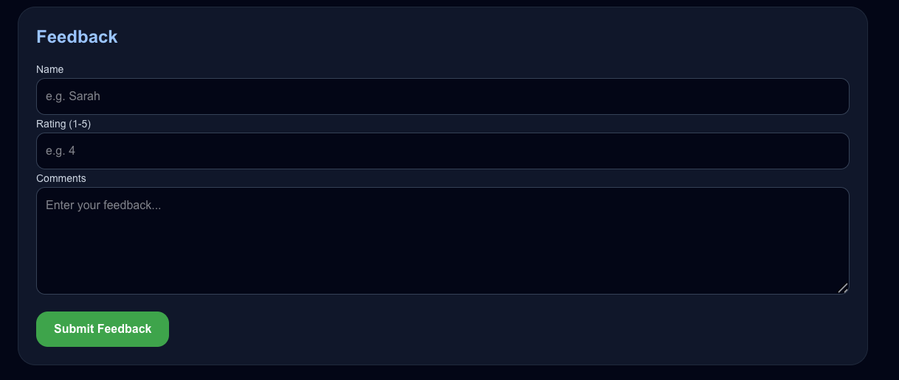

# iNextLabs Smart Catering Operations Planner
###  

A hybrid AI and deterministic multi-agent system for intelligent catering workflow automation. The system helps catering teams generate structured catering plans by coordinating specialized AI agents for customer intake, menu planning, inventory, compliance, logistics, pricing, risk validation, proposal review, and feedback analysis.


## Quick Start

1. Clone the repository
2. Create and activate the Python virtual environment
3. Install backend dependencies from the project root directory
4. Configure backend `.env`
5. Start the FastAPI backend:
```bash
uvicorn api:app --reload
```
6. Configure frontend `.env.local`
7. Start Next.js frontend:
```bash
cd frontend
npm run dev
```
8. Open http://localhost:3000


## Table of Contents

- Problem Statement
- Solution Overview
- Tech Stack
- Features
- AI Agents
- Workflow Orchestration
- Business Validation
- Knowledge Base Integration
- Enterprise Workflow Design
- System Architecture
- Installation
- Deployment
- Environment Variables
- Test Cases
- Future Improvements


## Problem Statement Summary

Catering businesses often manage customer requirements, menu planning, inventory, procurement, logistics, pricing, and risk checks manually. This can lead to poor demand estimation, supplier issues, inconsistent pricing, and communication gaps.

This project solves the problem by using a multi-agent AI workflow that simulates a digital catering operations team.


## Solution Overview

The system allows customer requirements to be submitted catering requirements through a Next.js frontend interface. Requests are processed by a FastAPI backend where a Microsoft Agent Framework workflow orchestrates specialized AutoGen Assistant Agents powered by Microsoft Foundry-hosted GPT-4o inference.

The system combines:
- Microsoft Agent Framework workflow orchestration
- AutoGen Assistant Agents for specialized AI behaviors
- Microsoft Foundry GPT-4o cloud-hosted inference
- Deterministic Python-based pricing and validation
- Azure AI Search knowledge retrieval
- Azure Blob Storage persistence
- Real-time Server-Sent Event (SSE) workflow updates

Unlike purely generative AI systems, this platform separates:
- AI responsibilities (recommendation, proposal generation, optimization)
- deterministic backend logic (pricing, validation, dietary checks, operational constraints)

This architecture improves reliability and enforces business rules consistently.


## Tech Stack

- Next.js
- TypeScript
- Tailwind CSS
- FastAPI
- Python
- Microsoft Foundry
- GPT-4o
- Microsoft Agent Framework
- Azure AI Search
- Azure Blob Storage
- Server-Sent Events (SSE)
- GitHub


## Features

- Multi-agent catering workflow orchestration
- AI-powered menu planning
- Real-time workflow tracking through SSE streaming
- Deterministic validation engine
- Dietary, halal, pork-free, and lard-free compliance checks
- Operationally separated licensed bar service handling
- Logistics and procurement planning
- Inventory and compliance-driven proposal revision loops
- Azure AI Search knowledge retrieval
- Azure Blob Storage persistence
- Feedback analysis
- Budget optimization recommendations
- Ingredient substitution suggestions
- Execution monitoring dashboard
- Inventory and compliance confidence scores
- Licensed bar service handling
- Optional beverage and licensed alcohol service pricing logic
- State-based location dropdown for supported West Malaysia locations
- Dynamic required-field validation highlighting
- Real-time form validation feedback


## AI Agents

### 1. Receptionist Agent
Captures customer event requirements and extracts structured operational details.

### 2. Menu Planning Agent
Generates theme-aware catering menus while respecting dietary restrictions and halal requirements.

### 3. Inventory & Procurement Agent
Calculates procurement quantities, checks supplier availability, and estimates ingredient requirements.

### 4. Compliance Agent
Validates halal food compliance, dietary compatibility, pork/lard restrictions, and separate licensed alcohol handling rules.

### 5. Logistics Planning Agent
Generates structured catering operations timelines including procurement scheduling, kitchen preparation, staffing allocation, food holding safety, packing coordination, dispatch timing, and event setup execution.

### 6. Monitoring Agent
Performs deterministic operational auditing, supplier-risk validation, budget-risk escalation, dietary conflict detection, and execution monitoring across the multi-agent workflow.

### 7. Pricing & Optimization Agent
Explains deterministic pricing calculations, identifies major cost drivers, evaluates budget alignment, and generates practical optimization strategies using ingredient substitutions and operational cost adjustments.

### 8. Proposal Review Agent
Evaluates customer experience, menu balance, premium perception, event suitability, catering practicality, operational realism, and business viability from a catering consultant perspective.

### 9. Feedback Analysis Agent
Analyzes the feedback sentiment and stores structured feedback records.


## Multi-Agent Workflow Orchestration

The system uses Microsoft Agent Framework to coordinate multiple specialized AI agents through a sequential catering operations workflow.

The workflow maintains shared context between agents and supports revision loops where agents refine proposals based on operational feedback.

### Workflow Pipeline

1. Receptionist Agent captures customer requirements
2. Azure AI Search retrieves operational catering knowledge
3. Menu Planning Agent generates an initial proposal
4. Inventory Agent validates ingredient quantities and shortages
5. Compliance Agent validates halal and dietary rules
6. Logistics Agent generates operational timelines
7. Monitoring Agent audits business and dietary risks
8. Pricing Agent explains pricing strategies and optimization insights
9. Proposal Review Agent evaluates proposal quality
10. Final validation rules are enforced before Azure Blob persistence

### Revision Loop Workflow

The system supports operational revision loops between agents.

Examples:
- Inventory shortages may trigger menu substitutions
- Compliance violations may trigger dietary revisions
- Budget exceedance may trigger pricing optimization recommendations
- Monitoring validation may escalate operational risks

This creates a feedback-driven orchestration workflow rather than a single-pass AI generation pipeline.

### Agent-to-Agent Collaboration

Agents exchange operational validation feedback to support sequential proposal refinement.

Example:
- Inventory feedback may trigger menu revision
- Compliance validation may trigger dietary substitutions
- Monitoring Agent performs final operational and dietary risk auditing


## Hybrid AI + Deterministic Architecture

The system uses a hybrid architecture where AI agents generate recommendations and operational reasoning, while deterministic Python logic enforces critical business constraints. 

### Dynamic Business Validation

The platform performs deterministic business validation after AI proposal generation.

Validation includes:
- Budget exceedance detection
- Supplier availability risk scoring
- Procurement shortage detection
- Theme authenticity validation
- Catering practicality validation
- Dietary conflict detection
- Event suitability analysis
- Operational feasibility checks

The system prevents unsupported or operationally risky catering proposals from being accepted without revision.

### AI Responsibilities
- Menu generation
- Proposal writing
- Procurement reasoning
- Logistics planning
- Risk explanation
- Proposal quality review

### Deterministic Python Responsibilities
- Pricing calculations
- Budget validation
- Dietary conflict validation
- Guest count constraints
- Event timing validation
- Location support validation
- Theme authenticity validation
- Risk enforcement

This architecture prevents common LLM issues such as:
- Hallucinated pricing
- Invalid totals
- Contradictory compliance checks
- Unsupported operational requests

The platform supports hybrid halal catering operations where licensed alcohol service may exist as a separately managed operational workflow without affecting halal food preparation processes.


## Real-Time Workflow Monitoring

The frontend uses Server-Sent Events (SSE) to stream live workflow progress updates while agents coordinate the catering plan generation process. The SSE progress engine uses weighted workflow progression to prevent inaccurate frontend jumps during asynchronous agent execution and revision loops.

The UI visualizes:
- active AI agent execution
- operational validation stages
- pricing and risk auditing
- proposal review progression
- Azure persistence status

The workflow progress system supports:
- dynamic agent state tracking
- weighted progress visualization
- sequential orchestration updates
- execution monitoring feedback


## Business Rules & Validation

The platform includes deterministic business validation rules enforced through Python.

### Supplier Intelligence

The inventory engine supports:
- supplier availability tracking
- limited-stock detection
- procurement lead-time awareness
- shortage escalation
- ingredient substitution recommendations

The system can generate operational procurement reports for catering execution planning.

### Licensed Alcohol Service Rules

The platform supports optional licensed alcohol service for eligible events.

Operational rules enforced:
- Alcohol service must remain separate from halal food preparation
- Alcohol transport must be separated from food logistics
- Bar setup must remain isolated from food stations
- Alcohol ingredients are prohibited in food preparation workflows
- Food operations remain halal-compliant only under operational separation conditions

### Operational Constraints
- Minimum guests: 20 pax
- Maximum guests: 500 pax
- Minimum quality budget: RM70 per head
- Maximum operational budget: RM500 per head

### Validation Checks
- Dietary conflict detection
- Pork and lard prohibition enforcement
- Alcohol separation workflow validation
- Theme authenticity validation
- Event timing validation
- West Malaysia location support validation
- Pricing sanity validation
- Budget exceedance detection

### Supported Dietary Restrictions
- Vegetarian
- Vegan
- Nut Allergy
- Dairy Free
- Gluten Free

### Risk Escalation System

The platform dynamically escalates operational risks based on:
- budget exceedance severity
- supplier availability
- procurement shortages
- compliance violations
- operational feasibility

Risk levels include:
- LOW
- MEDIUM
- HIGH


## Supported Catering Themes

- Japanese Fusion
- Traditional Malay
- Chinese Fusion
- Western Corporate


## Knowledge Base Integration

The system integrates Azure AI Search as an external knowledge retrieval layer.

Knowledge documents include:
- Supplier availability data
- Catering inventory rules
- Theme-specific cuisine guidelines
- Halal compliance standards
- Licensed alcohol separation operational guidelines
- Risk rulebooks
- Dietary substitution recommendations
- Logistics handling rules

The AI agents use this retrieved knowledge to generate more grounded operational decisions.


## System Architecture


### Frontend
- Next.js
- TypeScript
- Tailwind CSS
- Real-time SSE workflow tracking

### Backend
- FastAPI
- Python
- Microsoft Agent Framework
- AutoGen Assistant Agents
- Microsoft Foundry integration

### Cloud Services
- Azure AI Search
- Azure Blob Storage


## Installation Requirements

Before running the project, ensure the following are installed:

- Python 3.11+
- Node.js 18+
- Git

### AutoGen & Microsoft Foundry Installation

Install AutoGen dependencies for Microsoft Foundry GPT-4o integration:

```bash
pip install -U autogen-agentchat autogen-ext[openai]
```


## Setup Instructions

### Python Virtual Environment Setup

Create and activate a Python virtual environment:

#### macOS/Linux
```bash
python3 -m venv venv
source venv/bin/activate
```

#### Windows
```bash
python -m venv venv
venv\Scripts\activate
```

### Backend
Run from the project root directory:
```bash
pip install -r requirements.txt
uvicorn api:app --reload
```
Make sure all Azure credentials are configured before starting the backend server.

### Frontend

```bash
cd frontend
npm install
npm run dev
```

## Microsoft Foundry Setup

Deploy a GPT-4o model in Microsoft Foundry and configure:

- FOUNDRY_ENDPOINT
- FOUNDRY_API_KEY
- FOUNDRY_DEPLOYMENT
- FOUNDRY_MODEL

FOUNDRY_DEPLOYMENT refers to the deployed model endpoint name.
FOUNDRY_MODEL refers to the actual model version used for inference and token estimation.

The system uses AutoGen AzureOpenAIChatCompletionClient for Microsoft Foundry GPT-4o cloud inference.

1. Open Microsoft Foundry
2. Create a Foundry project
3. Deploy a GPT-4o model endpoint
4. Copy:
   - Endpoint URL
   - API Key
   - Deployment Name
5. Configure the environment variables in `.env`


## Deployment Architecture

Frontend:
- Next.js hosted separately

Backend:
- FastAPI API service
- AzureOpenAIChatCompletionClient integration

AI Inference:
- Microsoft Foundry GPT-4o endpoint

Cloud Services:
- Azure AI Search
- Azure Blob Storage

Workflow:
- Microsoft Agent Framework + AutoGen orchestration


## Environment Variables

Example environment variable templates are provided in:
- .env.example
- frontend/.env.local.example

### Backend Environment Variables

Create a `.env` file in the project root directory:

```env
AZURE_SEARCH_ENDPOINT=
AZURE_SEARCH_KEY=
AZURE_SEARCH_INDEX=
AZURE_STORAGE_CONNECTION_STRING=
AZURE_STORAGE_CONTAINER=plans
FOUNDRY_ENDPOINT=
FOUNDRY_API_KEY=
FOUNDRY_DEPLOYMENT=
FOUNDRY_MODEL=gpt-4o-2024-11-20
```

### Frontend Environment Variables

Create a `.env.local` file inside the `frontend/` folder:

```env
NEXT_PUBLIC_API_URL=http://127.0.0.1:8000
```

IMPORTANT:
- `.env` is used by the FastAPI backend.
- `.env.local` is used by the Next.js frontend.
- Restart both frontend and backend servers after changing environment variables.


## Example Test Cases

### Test Case 1 — Successful Japanese Vegetarian Wedding
- Wedding
- Kuala Lumpur
- 100 pax
- Vegetarian
- RM100/head
- Japanese Fusion
- Eco-friendly packaging

Expected:
- Successful proposal generation
- Pricing optimization recommendations generated if budget exceeds threshold
- LOW RISK dietary validation
- Inventory risk analysis generated

### Test Case 2 — Budget Below Quality Floor
- Corporate Lunch
- 80 pax
- RM50/head
- Western Corporate

Expected:
- Pricing validation warning
- Quality floor enforcement

### Test Case 3 — Unsupported Location
- Birthday Party
- Singapore
- 50 pax

Expected:
- West Malaysia validation failure

### Test Case 4 — Dietary Conflict Detection
- Vegetarian request
- Notes include chicken dish

Expected:
- Monitoring Agent flags dietary conflict

### Test Case 5 — Corporate Event with Licensed Bar Service

- Corporate Dinner
- Kuala Lumpur
- 120 pax
- Western Corporate
- Wine catering requested

Expected:
- Licensed bar service fee added
- Alcohol separation notice generated
- Food operations remain halal-compliant
- Monitoring Agent validates operational separation


## Future Improvements

- Real supplier API integration
- Dynamic market-based pricing
- Live inventory synchronization
- Real-time kitchen monitoring
- Multi-language catering support
- Fine-tuned catering-specific LLMs
- Customer analytics dashboard
- Cloud deployment on Azure infrastructure
- Mobile application support
- Advanced recommendation engine


## Screenshots

### Homepage


### Real-Time Workflow Progress


### Generated Catering Plan


### Terminal Output


### Proposal Review


### Feedback


### Feedback Submission


### Test Cases


### System Architecture


### Microsoft Foundry GPT-4o Integration


## Author

Myat Pan Ei Thu

