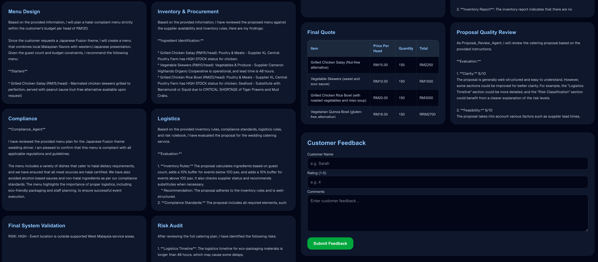

# # iNextLabs Smart Catering Operations Planner (Microsoft Agent Framework)

An AI-powered multi-agent system for smart catering operations. The system helps catering teams generate structured catering plans by coordinating specialized AI agents for customer intake, menu planning, inventory, compliance, logistics, pricing, risk validation, proposal review, and customer feedback analysis.

## Problem Statement Summary

Catering businesses often manage customer requirements, menu planning, inventory, procurement, logistics, pricing, and risk checks manually. This can lead to poor demand estimation, supplier issues, inconsistent pricing, and communication gaps.

This project solves the problem by using a multi-agent AI workflow that simulates a digital catering operations team.

## Solution Overview

The system allows a customer to enter event details through a Next.js frontend. The request is sent to a FastAPI backend, where a Microsoft Agent Framework workflow orchestrates multiple Ollama-powered AI agents to collaboratively generate a complete catering plan.

The system also uses Azure AI Search as a knowledge base and Azure Blob Storage to store generated plans and customer feedback. Each plan is assigned a `plan_id`, and feedback is linked back to the same plan.

## Tech Stack

- Next.js
- TypeScript
- Tailwind CSS
- FastAPI
- Python
- Ollama
- Microsoft Agent Framework
- Azure AI Search
- Azure Blob Storage
- Server-Sent Events (SSE)
- GitHub

## Features

- Multi-agent catering workflow
- AI menu planning
- Inventory & procurement analysis
- Halal compliance validation
- Allergy conflict detection
- Logistics planning
- Pricing optimization
- Deterministic risk validation
- Customer feedback analysis
- Azure AI Search integration
- Azure Blob Storage persistence
- Real-time SSE workflow updates
- Microsoft Agent Framework orchestration
- Agent-to-agent revision workflow
- Real-time workflow progress visualization

## AI Agents

- Receptionist Agent
- Menu Planning Agent
- Inventory & Procurement Agent
- Compliance Agent
- Logistics Planning Agent
- Monitoring Agent
- Pricing Optimization Agent
- Proposal Review Agent
- Feedback Analysis Agent

## Workflow Orchestration

The system uses Microsoft Agent Framework to orchestrate the catering workflow pipeline. The workflow coordinates multiple specialized AI agents in sequence while maintaining shared context between agents.

The orchestration layer manages:

- Sequential execution of agents
- Shared workflow context
- Agent-to-agent communication
- Proposal revision loops
- Final workflow output generation

The workflow is implemented using `WorkflowBuilder` and custom executors integrated with FastAPI.

## Agent-to-Agent Communication

The system demonstrates agent-to-agent communication through shared workflow context, revision loops, and orchestrated task coordination.

Examples include:

- The Menu Planning Agent generates an initial menu proposal.
- The Inventory & Procurement Agent evaluates supplier availability, shortages, and procurement constraints.
- The Menu Planning Agent revises the proposal based on inventory feedback.
- The Compliance Agent validates halal compliance, allergy restrictions, and sustainability requirements.
- The Menu Planning Agent updates the proposal again after compliance validation.
- The Monitoring Agent audits the complete plan for operational and business risks.
- The Pricing Optimization Agent generates a final optimized quotation within customer budget constraints.
- The Proposal Review Agent performs a final corporate-style proposal quality review.

This coordinated workflow simulates a real-world catering operations team where specialized departments collaborate to refine and validate operational decisions.

## System Architecture


## Setup Instructions

### Backend
```bash
pip install -r requirements.txt
uvicorn api:app --reload
```

### Frontend

```bash
cd frontend
npm install
npm run dev
```
## Environment Variables

### Backend Environment Variables

Create a `.env` file in the project root directory:

```env
AZURE_SEARCH_ENDPOINT=
AZURE_SEARCH_KEY=
AZURE_SEARCH_INDEX=
AZURE_STORAGE_CONNECTION_STRING=
AZURE_STORAGE_CONTAINER=plans
OLLAMA_MODEL=llama3.2:3b
```

### Frontend Environment Variables

Create a `.env.local` file inside the `frontend/` folder:

```env
NEXT_PUBLIC_API_URL=http://127.0.0.1:8000
```

IMPORTANT:
- `.env` is used by the FastAPI backend.
- `.env.local` is used by the Next.js frontend.
- Restart both frontend and backend servers after changing environment variables.

## Example Test Cases

### Valid Case (Test Case 1)
- Wedding Dinner
- Kuala Lumpur
- 150 pax
- Vegetarian
- RM120/head
- Japanese Fusion Theme
- 14-day preparation window

### High Risk Case (Test Case 2)

- London
- Same-day event
- Nut allergy conflict
- RM50/head luxury request

## Future Improvements

- Supplier portal integration
- Live inventory synchronization
- Customer dashboard
- Analytics reporting
- AI-powered menu recommendation engine

## Author

Myat Pan Ei Thu

Expand it:
## Screenshots

### Homepage


### Real-Time Workflow Progress


### Generated Catering Plan


### Proposal Review


### Feedback Submission


### System Architecture

```

